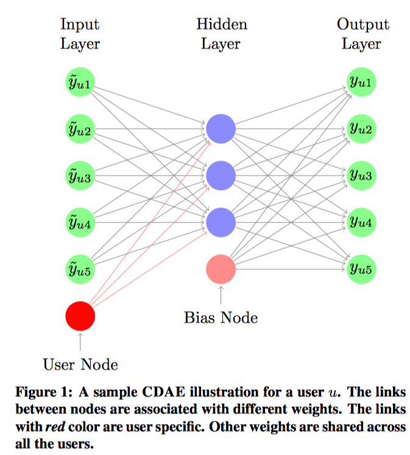
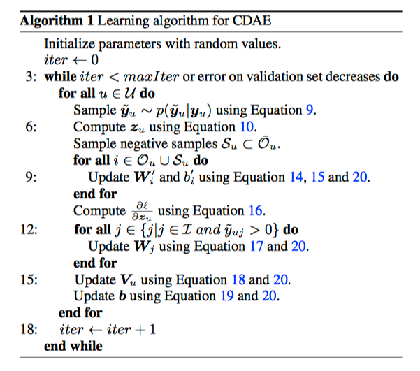

## Collaborative Denoising Auto-Encoders for Top-N Recommender Systems

**If the formula dosen't show complete, please read the pdf version.**

Implementation of **Collaborative Denoising Auto-Encoders for Top-N Recommender Systems** with Tensorflow.

Paper: http://alicezheng.org/papers/wsdm16-cdae.pdf

### 1 - INTRODUCTION
* Collaborative Denoisig Auto-Encoders(CDAE) assumes that whatever user-item interactions are observed are a currupted version of the user's full preference set.< CF所需要的users-items資料是一個很大的稀疏矩陣，對應每位使用者所看過的items，有些空格有值有些沒有，所以這邊用*currupted data*來嬋述這樣的想法 >
* Denoising Auto-Encoders train a one-hidden layer neural network to reconstruct a data point from the latent representation of its partially corrupted version.

### 2 - PROBLEM DEFINITION
* Set of users $ U = \lbrace u = 1,\dots,U \rbrace $
* Set of items $ I = \lbrace i = 1,\dots,I \rbrace $
* $ O = \left( u, i, y_{ui} \right)$ is a log of the user's past preferences of  items.
  * $y_{ui}$ could be the numeric ratings in the range of [1, 5] or binary values {0, 1}
* $ \bar{O} $ to denote the set of **unobserved, missing triples.**
* $ O^{'} $ is an augmented user-item paris dataset that includes some data sampled $ \bar{O} $
  * add **negative set**[^2] in training set.
* $ O_{u} $ denote the set of item preferences in the training set for a particular user $ u $
* $ \bar{O}_{u} $ the unobserved preferences of user u. 
  * Items in $\bar{O}_{u}$ are the candidates to be **recommended to user $u$**

#### 2.1 Overview of Model-based Rcommenders
Most machine learning models can be specified through two components: model definition and objective function during training.
* Rcommender Model
  * Latent Factor Model(LFM)
  * Similarity Model(SM)
    * 使用weight combination of items來對應user在items $i$ 與 items $j$ 之間的相似度，這是一種類似`item-based of KNN`的概念。
    * 基本用`Jaccard` or `Cosine`做相似度的計算，但在**SM**是從資料學習**similarity matrix**來替代
  * Factorized Similarity Model(FSM)
    * 改善SM的執行效率較差的部分，直接拆解similarity matrix 為 two low rank matrix
  * LFSM (LFM + FSM)
* Objective Functions for Recommenders
  * [Point-wise][^1]: only depend on the accuracy of the prediction of individual preferences.
    * Approaches:
      Looking at a **single document** at a time in the loss function. They essentially take a single document and train a classifier / regressor on it to predict how relevant it is for the current query. The final ranking is achieved by simply sorting the result list by these document scores. For pointwise approaches, the score for each document is independent of the other documents that are in the result list for the query.
    * objective function: 
       $$
       \sum_{\left( u, i \right) \in O^{'}} \space l_{point} \left( y_{ui}, \hat{y}_{ui} \right) + \lambda\Omega\left( \theta \right)
       $$

  * [Pair-wise][^1]: objectives approximates ranking loss by considering the relative order of the predictions for pairs of items.
    * Approaches:
      Looking at a **pair of documents** at a time in the loss function. Given a pair of documents, they try and come up with the optimal ordering for that pair and compare it to the ground truth. The goal for the ranker is to minimize the number of inversions in ranking i.e. cases where the pair of results are in the wrong order relative to the ground truth. 
    * objective function:
    $$
    \sum_{\left( u, i, j \right) \in P} \space l_{pair} \left( y_{uij}, \hat{y}_{uij} \right) + \lambda\Omega\left( \theta \right)
    $$
    where $ y_{uij} = y_{ui} - y_{uj}, \hat{y}_{uij} = \hat{y}_{ui} - \hat{y}_{uj} $, and $ P $ is a set of tripltes samepled from $ O^{'} $

> **Pair-wise** functions are usually considered to be more suitable for optimizing top-N recommendation performance.

* Key point:
  1) a suitable way to represent the relations between inputs and outputs. 
  2) a proper objective function and a proper way to deal with the relationship between observed and unobserved feedback.
___
[^1]: [Pointwise vs. Pairwise vs. Listwise Learning to Rank](https://medium.com/@nikhilbd/pointwise-vs-pairwise-vs-listwise-learning-to-rank-80a8fe8fadfd)
[^2]: Here we use the term negative to denote missing feedback.

#### 2.2 Denoising Auto-Encoders
Classical auto-encoder is typically implemented as a onehidden-layer neural network that takes a vector as input $ \text{vector } x \in \Re^{D} $ as input data and maps it to a hidden representation $z \in\Re^{K}$ through a mapping function
$$
z = h\left( x \right) = \sigma\left( W^{\top}x + b \right)
$$
where $ W $ is a $ D \times K $ weight matrix and $b \in K$ is an offset vector.The result latent representation is them mapped back to a reconstructed vector 
$$
\hat{x} = \sigma\left( W^{'} z + b^{'} \right)
$$
The reverse mapping may optionally be constained by *tied weights*, where $ W^{'} = W$.
The parameters of model are trained to minimize the average reconstruction error
$$
\operatorname*{arg\,max}_{W, W^{'}, b, b^{'}} \frac{1}{n} \sum_{i=1}^{n} l\left(  x_{i}, \hat{x_{i}} \right)
$$
where $l$ is loss function.
**The Denoising Auto-encoder(DAE) extends the classical auto-encoder by training to reconstruct each data point $x$ from corrupt version $\tilde{x}$.** The goal of DAE is to force the hidden layer to discover more robust features and to prevent it from simply learning the identity function. The corrupted input $\tilde{x}$ is typically drawn from a conditional distribution $p\left(\tilde{x}|x\right)$. `Common corruption choices are the additive Gaussian noise and the multiplicative mask-out/drop-out noise.` 

Under mask-out/drop-out corrupted version, randomly overwrite each of dimensions of $x$ with 0 with a probability of $q$
$$
\begin{cases}
P\left( \bar{x}_{d} = \delta x_{d} \right) = 1 - q \\
P\left( \bar{x}_{d} = 0\right) = q
\end{cases}
$$
To make sure **the corruption unbaised**, setting the **uncorrupted values $\delta = 1/(1-q)$ times** the original value.

### 3 - PROPOSED METHODOLOGY

The model learns correlations between the user's item preference by training on a *corrupted version* of the know preference set.

#### 3.1 Collaborative Denoising Auto-Encoder
* Similar to the standard Denoising Auto-Encoder(DAE) has three layers, including the input layer, the hidden layer and output layer.
* The key different with standard DAE is that the input `encodes a latent vector for the user`.
* Total $ I+1 $ nodes in the input layer which first $I$ nodes corresponds to an item and the last node is a `user specific node`. This means the node is associated weights are unique for each user $ u \in U$ in the data.
  * First $ I $ nodes as item input nodes, and the last node as user input node.
  * There are K nodes in hidden layers and fully connected to the nodes of the input layer.
    * K is predefined constant which is usually much smaller than the size of input vectors.
            

Here use $W \in R^{I \times K}$ to denote the weight matrix between the items input nodes and nodes in hidden layer, and $V_{u} \in R^{K}$ is a user-specific vecoter for each of the users.

In the output layer, the matrix is deonted by $W^{'} \in R^{I \times K}$ and $b\in R^{I}$ denoted the weight vector for the bais node in hidden layer.

Algorithm step explain:
* Step 3
* Step 6
* Step 9 : use $ O_{u} \bigcup S_{u} $ to compute gradient.
    * Because the time complexity of one iteration over all users is $ O\left( UIK \right) $, if number of users and number of itmes are large.
    * `Instead of computing the gradients on all outputs, use sample a subset of the negative items $ S_{u} $ from $ \bar{O_{u}}$ and compute the gradient on the items in $  O_{u} \bigcup S_{u}  $.
* Step 12
* Step 15
* Step 18

### 4 - RELATED WORK
* Restricted Boltzmann Machines(RBM):
  * The first works to applies nerual network models to recommender systems.
    * Not top-N recommendation.
    * Loss function only considers the observed ratigs.
* Auto-Encoder for rating prediction(AutoRec):
    * Only considers the observed ratings in the loss function and does not guarantee the performance for top-N recommendation.
    * Using the vanilla AutoEncoder structure.
    * Does not employ the denoising technique.

### 5 - EXPERIMENTAL RESULTS
github: https://github.com/jasonyaw/CDAE
#### 5.1 Data Sets and Experimental Setup
Data Sets:
1. [MovieLens 10M](#https://grouplens.org/datasets/movielens/)
2. [Netflix](#https://www.netflixprize.com/)
3. [Yelp](#https://www.yelp.com/dataset/challenge)(from Yelp Dataset Challenge in 2014)

Key Point:
1. For each data set, keep those with ratings no less than 4 stars and treat all other ratings as missing entries.
2. Those ratings that are retained are converted to a $y_{ui}$ score of 1. This processing method is widely used in previous work on recommendation with implicit feedback.We iteratively remove users and items with fewer than 5 ratings.
3. For each user, we randomly hold $20\%$ of the ratings in the test set, and put the other ratings in the training set.

#### 5.2 Implementation Details
* Use 5-fold cross validation on the training data sets.
* Use AdaGrad to automatically adapt the step size.
  * $\beta = 1$ and try different step size $\eta \in \lbrace 1, 0.1, 0.01, 0.001 \rbrace$
* For negative sampling, $NS = 5$ consistently produces good results.
  * This means that, for each user, **the number of negative samples is 5 times the number of observed ratings of this user.**
  * 

#### 5.3 Evaluation Metrics
* Precision and Recall.Given a top-N recommendation list $ C_{N, rec}$
$$
\begin{aligned}
Precision@N & = \frac{\mid C_{N, rec} \bigcap C_{adopted}\mid}{N} \\ 
Recall@N & = \frac{\mid C_{N, rec} \bigcap C_{adopted}\mid}{C_{adopted}} \\
\end{aligned}
$$
where $C_{adopted} are the items that a user has adopted on the test$
* Mean Average Precision(MAP)
  * the mean of the AP scores for all users. 
  * [Average precision(AP)](#https://medium.com/@jonathan_hui/map-mean-average-precision-for-object-detection-45c121a31173) is a ranked precision metric that gives larger credit to correctly recommended items in top ranks.
    $$
    AP@N = \frac{\sum_{k=1}^{N} Precision@k \times rel\left( k \right)}{min\lbrace N,\mid C_{adopted}\mid \rbrace}
    $$
    where $Precision\left( k \right)$ is the precision at cut-off $k$ in the top-N list $C_{N, rec}$ and $rel(k)$ is an indicator function equaling 1 if items at rank $k$ is adopted, otherwise 0.

### Reference
1. https://www.datacamp.com/community/tutorials/autoencoder-keras-tutorial
2. https://github.com/henry0312/CDAE
3. https://github.com/gtshs2/Collaborative-Denoising-Auto-Encoder
4. https://ithelp.ithome.com.tw/articles/10188390