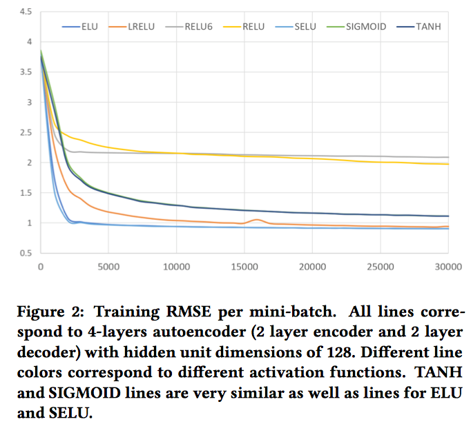
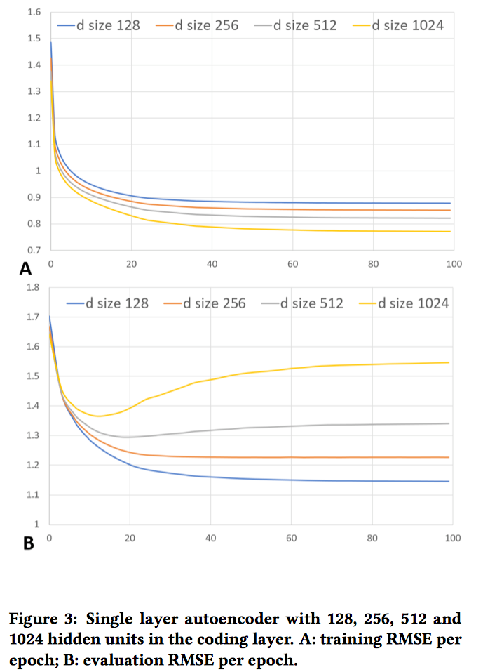
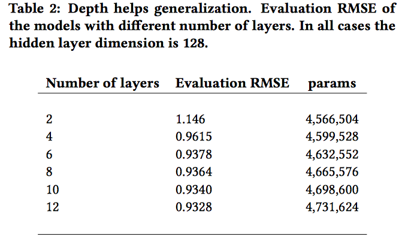
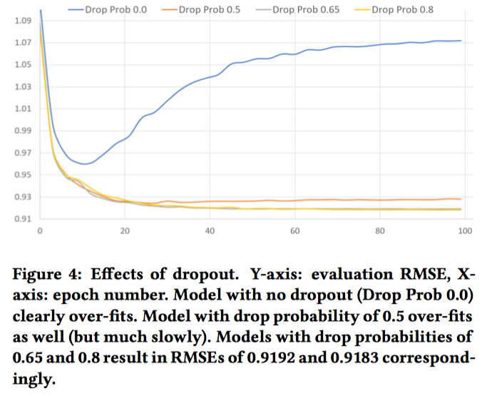
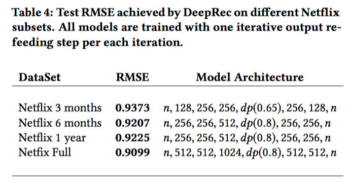

## Training Deep AutoEncoders for Collaborative Filitering

Implementation of **Training Deep AutoEncoders for Collaborative Filtering** with Tensorflow.

Paper: https://arxiv.org/abs/1708.01715

Github: https://github.com/NVIDIA/DeepRecommender

### 1 - INTRODUCTION

This paper proposes a model for the **rating prediction task** in recommender systems.

* Data Set: 
   time-split Netflix data set.
* Key Point:
    a) deep autoencoder models generalize much better than the shallow ones.
    b) non-linear activation functions with negative parts are crucial for training deep models.	
    c) heavy use of regularization techniques such as dropout is necessary to prevent overfitting.

#### 1.1 Related Work
1. Restricted Boltzman machines(RBM) 
2. Deep autoencoders
    * I-AutoRec(item-based autoencoder)
    * U-AutoRec(user-based autoencoder)
3. Feed-forward neural network
4. Recurrent recommender networks

### 2 - MODEL
Use **U-AutoRec** with several important **distinctions**.
	1. No pre-training model
	2. Use **Scaled exponential linear units(SELUs)**
	3. Use high dropout rates
	4. **Use iterative output re-feeding during training**

> The *goal* of autoencoder is to obtain d dimensional representaion of data such that an error measure between $ x $ and $ f\left( x \right) = decode\left( encode\left( x \right) \right) $ is minimized.

If noise is added to the data during encoding step, the autoencoder is called **de-noising**.

> In our model, both encoder and decoder parts of the autoencoder consist of feed-forward neural networks with classical fully connected layers computing $ l = f \left(W ∗ x + b\right) $, where f is some non-linear activation function.

#### 2.1 Loss Function
Masked Mean Squared Error Loss
$$
MMSE = \frac{m_{i} * \left( r_{i} - y_{j} \right)}{\sum_{i=0}^{i=n} m_{i}}
$$
where $ r_{i} $ is actual rating, $ y_{i} $ is reconstructed or predicted rating, and $ m_{i} $ is a mask function such that $ m_{i} = 1 $ if $ r_{i} \not= else  \space m_{i} = 0 $.

> Note that there is a straightforward relation between RMSE score and MMSE score: $ RMSE = \sqrt{MMSE} $.

#### 2.2 Dense re-feeding
During training and inference, an input $ x \in R^{n} $ is very sparse and anutoencoder's output $ f\left( x \right)$ is dense. Then $ f\left( x \right)_{i} = x_{i}, x_{i} \not= 0 \space and \space f\left( x \right)_{i} $ accurately predicts all user's *feature* rating for items i: $ x_{i} = 0 $. This means that if user rates new item k (creating a new vector $ x^{'} $) then $ f\left( x \right)_{k} = x_{k}^{'}  \space and \space f\left( x \right) = f\left( x^{'} \right)$. Hence, in this idealized scenario, $ y = f\left( x \right) $  should be a fixed point of a well trained autoencoder: $ f\left( y \right) = y $.

To explicitly enforce **fixed-point** constraint and to be able to perform dense training updates, we augment every optimization iteration with an **iterative dense re-feeding steps** (3 and 4 below) as follows:
	(1) Given sparse $x$, compute dense $f \left( x \right) $ and loss using equation 1 (forward pass)
	(2) Compute gradients and perform weight update (backward pass)
	(3) Treat $ f \left( x \right)  $ as a new example and compute $ f\left( f \left( x \right) \right) $. Now both $ f \left( x \right)  $and $ f\left( f \left( x \right) \right) $ are dense and the loss from equation 1 has all m as non-zeros. (second forward pass)
	(4) Compute gradients and perform weight update (second backward pass) S
teps (3) and (4) can be also performed more than once for every iteration.

### 3 EXPERIMENTS AND RESULT
#### 3.1 Experiment setup
* batch size of 128
* use SGD with momentum of 0.9
* learning rate of 0.001
* use xavier initialization to initialize paramters
* no use any [layer-wise pre-training](https://blog.csdn.net/JNingWei/article/details/78836823)

#### 3.2 Effects of the activation types
Explore the effect of different activation functions:
* Sigmoind
* RELU
* RELU6 = $ max\left( relu\left( x\right), 6 \right) $ 
* Hyperbolic tangent(TANH)
* Exponential linear units(ELU)
* Leaky relu(LRELU)
* Scaled exponential linear units(SELU)

on the 4 layer autoencoder with 128 units in each hidden layer.

> Because ratings are on the scale from 1 to 5, we keep last layer of the decoder linear for sigmoid and tanh-based models

We found that on this task ELU, SELU and LRELU perfom much better than sigmod, RELU, RELU6 and tanh.
The two key points:
	1. non-zero negative part
	2. unbound positive part

Thus, we use SELU activation units and tune SELU-based networks for performance.

#### 3.3 Over-fitting the data
The first layer of encoder will have $ d * n + d $ weight, where d is number of units in the layer, n is  number of items. We show that quick overfit to the training data even d as same as 512.

#### 3.4 Going deeper
Due to experiments choose the small enough dimensionality $ \left( d = 128 \right) $ for all hidden layers to easily avoid over-fitting and adding more layer. Table 2 shows that there is positive correlation between the number of layers. But, after adding more layers does help, however it provides **diminishing returns**.

#### 3.5 Dropout
At the paper, to regularize model, the experiment tried several dropout values and, interestingly, very high values of drop probability $ \left( e.g. 0.8 \right) $ turned out to be the best. Only applying dropout on the encoder output $ \left( e.g. f\left( x \right) = decode\left( dropout\left( encode\left( x \right) \right) \right) \right) $ and tried applying dropout after every layer of the model but that stifled training convergence and did not improve generalization.

### 4 CONCLUSION
In the paper does not explicitly take into account temporal dynamics of ratings.
Sucessfully using below method:
1. Drouput(0.8)
2. Scaled exponential linear units
3. Iterative output re-feeding
4. Increase learning rate

Model architecture:

### Reference
1. https://hk.saowen.com/a/89ffa569973688589ee4193ae804e6265d15d3dfe5812aa36b2cca129e443def
2. https://github.com/hadlaq/AECF
